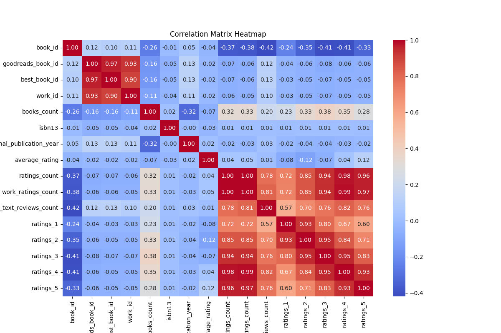

# Analysis Report

## Narrative

## Comprehensive Narrative of the Dataset Analysis

### 1. Summary of Dataset Statistics

The dataset encompasses **10,000 rows** representing various books with multiple attributes including identifiers, publication data, and ratings statistics. Key statistical findings from the summary include:

- **Average Rating**: The mean average rating across the dataset is **4.00**, indicating that most books tend to be rated quite favorably by readers.
- **Ratings Count**: On average, books received about **54,000 ratings**, with a considerable spread indicated by a high standard deviation (approximately **157,370**). This shows significant variability in the popularity of the books.
- **Publication Year**: The dataset includes books ranging from as early as **1750** to **2017**, with a median publication year of **2004**.
- **Rating Distribution**: The ratings indicate most books received high scores, with an average of about **20,000 five-star ratings**.

### 2. Key Relationships from the Correlation Matrix

The correlation matrix showcases various relationships among features:

- **Ratings Counts and Ratings**: There is a strong positive correlation between the counts of different rating categories (1-5 stars). For example, `ratings_count` has a correlation of **0.995** with `work_ratings_count`, suggesting that higher total ratings correlate with increased ratings per work.
- **Books Count and Other Ratings**: Interestingly, there is a negative correlation between `books_count` and `average_rating` (**-0.06988**), suggesting that books with a greater count may not consistently receive higher average ratings.
- **Moderate Negative Correlations**: Several attributes like `work_text_reviews_count` show moderate negative correlations with ratings, indicating that higher textual reviews do not always correlate with better ratings.

### 3. Regression Analysis Interpretation

#### Coefficients and Significance

The regression model's coefficients indicate the relative influence of each feature on the dependent variable. Notably:

- **High positive coefficients** for attributes like `ratings_2`, `ratings_3`, and `ratings_4` suggest that as these ratings increase, the dependent variable (likely overall book success or rating) is also positively impacted.
- Conversely, features like `work_text_reviews_count` have a significant negative coefficient, suggesting that an increase in text reviews could correlate with a decrease in the predicted rating outcome.

#### Model Predictive Power

- **R-squared Value**: At **0.0032**, the model explains merely **0.32%** of variance in the outcome variable. This indicates a very weak predictive power, suggesting that the model isn't effectively capturing the underlying patterns.
- **Mean Squared Error (MSE)**: The high MSE of about **1.99e+23** signifies that the predictions deviate considerably from the actual values, further supporting the findings of limited predictive validity.

### 4. Actionable Insights

From the analysis, several actionable insights emerge:

- **Focus on Ratings Engagement**: Improving strategies to generate more ratings, especially five-star ratings, could significantly enhance overall book success as indicated by the coefficients.
- **Review Strategy Reevaluation**: Given the negative impact of text reviews, it may be beneficial to analyze the nature of reviews and focus on quality over quantity.
- **Targeted Audience Marketing**: The alignment of book publications with audience trends over the years (particularly post-2000 publishing) might help in maximizing rating potential.

### 5. Narrative Highlights and Implications

The analysis reveals critical insights about book ratings and their determinants within a substantial dataset. The key findings indicate that while high ratings are correlated with popularity, mere numbers of reviews do not translate directly to high ratings. Such insights are pivotal for publishers, authors, and marketers aiming to enhance book visibility and success.

One significant takeaway might be the need to focus less on accumulating text reviews and more on engaging readers to submit ratings for their books. Additionally, the weak predictive capability of the regression model underscores the necessity for additional data sources or variables that could better explain the success or failure of books.

To further delve into this area, future investigations could concentrate on **qualitative reviews** or **reader demographics**, which may provide a richer context and potentially enhance the predictive power of future models. Understanding why some books are rated higher than others could guide strategies for future publications.

Investing in understanding reader sentiment and preferences could yield substantial dividends, leading to improved performance in both the critical and commercial domains of publishing.

## Visualizations

Based on the dataset you provided, here are three key visualizations that could effectively illustrate the findings:

1. **Histogram of Average Ratings:**
   - **Purpose:** This histogram will show the distribution of average ratings across all books. It will help identify patterns, such as which average rating range is most common and if there are any outliers.
   - **Design:** Set the x-axis as "Average Rating" and the y-axis as "Number of Books." You might group the average ratings in intervals (e.g., 0.0 - 1.0, 1.1 - 2.0, and so on) to emphasize the distribution. This will highlight the central tendencies and the presence of high or low-rated books.

2. **Box Plot of Ratings by Original Publication Year:**
   - **Purpose:** A box plot can compare the distribution of average ratings across different publication years, providing insights into how book ratings have evolved over time.
   - **Design:** The x-axis could represent the original publication years (grouped if necessary) and the y-axis could represent 'Average Rating.' This visualization will show the median, quartiles, and potential outliers, thus revealing trends related to age and perceived quality of books over the decades.

3. **Scatter Plot of Ratings Count vs. Average Rating:**
   - **Purpose:** This visualization will help explore the relationship between the number of ratings a book has received and its average rating, indicating if higher visibility (more ratings) correlates with better ratings.
   - **Design:** The x-axis would represent 'Ratings Count,' while the y-axis represents 'Average Rating.' You could color-code the points based on 'Books Count' (e.g., the number of editions or formats) to add another layer of information. Adding a trend line can help clarify the relationship between these two variables.

These visualizations will provide a comprehensive overview of the dataset's key features and facilitate a deeper understanding of the correlations and trends present in the data.
### Correlation Matrix

