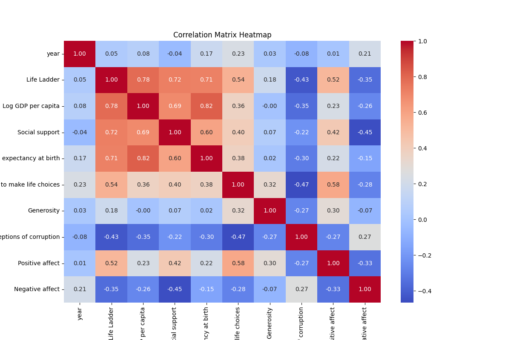

# Analysis Report

## Narrative

## Comprehensive Narrative on the Dataset Analysis

### 1. Summary of Dataset Statistics and Key Relationships from the Correlation Matrix

This dataset encompasses 2363 rows of observations and 10 attributes spanning aspects of human well-being, economy, and perception. Here are the summary statistics for the attributes:

- **Life Ladder** (a measure of subjective well-being) has a mean value of 5.48 and varies from 1.28 to 8.02. 
- **Log GDP per capita** averages at 9.40, indicating a wide range, with minimum and maximum values suggesting significant variations in economic wealth across the dataset.
- **Social support is high** with a mean of 0.81, while **freedom to make life choices (0.75)** and **healthy life expectancy (63.40 years)** suggest a generally favorable quality of life.
- The dataset also reflects a generally low level of **generosity** (mean of 0.00) and higher concern about **corruption** (mean perception score of 0.74).
  
The correlation matrix reveals several significant relationships:
- **Life Ladder** is highly correlated with **Log GDP per capita (0.78)**, **Social support (0.72)**, and **Healthy life expectancy (0.71)**, emphasizing the multi-dimensional nature of quality of life.
- Strong negative correlations exist between **Perceptions of corruption** and **Life Ladder (-0.43)**, suggesting that higher corruption perceptions are associated with lower life satisfaction.
- Notably, **Freedom to make life choices** correlates positively with **Life Ladder (0.54)**, indicating that autonomy significantly affects well-being.

### 2. Significant Features Based on Regression Coefficients

From the regression analysis, the coefficients indicate the significance of each factor in predicting the **Life Ladder**:

- **Log GDP per capita (3.77)** has the highest impact, revealing that economic prosperity is a primary determinant of well-being.
- **Social support (0.62)** and **Healthy life expectancy (0.44)** also have substantial positive effects.
- Conversely, **Perceptions of corruption** has a negative coefficient (-0.55), indicating that higher perceived corruption inversely affects life satisfaction.
  
These features highlight that enhancing economic conditions, social support systems, health measures, and fostering lower corruption perceptions are critical areas for improving life satisfaction.

### 3. Interpretation of Regression Results

The regression analysis yields:
- **Intercept**: 63.39, which signifies the baseline quality of life when other predictors are held constant.
- **Mean Squared Error (MSE)**: 12.92 suggests that predictions from the model can vary from actual values by this average squared amount.
- **R-squared Value**: 0.697 implies that approximately 70% of the variation in **Life Ladder** scores can be explained by the variables included in this model, demonstrating a reasonable fit.

Such a notable R-squared value indicates that the model holds predictive power, making it a potentially useful tool for assessing factors affecting life satisfaction.

### 4. Actionable Insights Based on the Analysis

Based on the analysis, a few actionable insights emerge:
- **Investments in health and social systems** could lead to significant improvements in life satisfaction; enhancing healthcare access and social support should be prioritized.
- **Addressing corruption** should be a strategic focus for governments, as this has a tangible negative relationship with well-being. Transparency and accountability initiatives could mitigate these perceptions.
- **Further investigations** should be conducted, especially to explore causality between freedom of choice and life satisfaction, informing policy directions.

### 5. Narrative Highlighting Key Findings

This dataset presents a revealing look into the intertwining factors influencing life satisfaction globally. It illustrates a correlation where economic wealth (Log GDP) strongly influences individuals' perceived quality of life, mediated by social support and health measures. The statistical significance of perceptions surrounding corruption further emphasizes the challenges that nations face amidst discrepancies in governance.

The implications for decision-makers are clear: to enhance public well-being, a comprehensive approach that touches upon economic growth, healthcare access, social services, and eradicating corruption is essential. As the findings suggest; making informed policy changes that improve these dimensions could lead to notable improvements in individual and societal happiness.

### Suggested Next Steps

Future research avenues include:
- Longitudinal studies to investigate how these variables may change over time.
- Expanding the analysis to include additional variables such as education levels or cultural factors, which may play a role.
- Evaluating the impact of specific policy interventions on corruption perceptions and life satisfaction metrics to craft more nuanced development strategies tailored to individual societies.

This nuanced analysis sheds light on the multifaceted nature of well-being and offers pathways to foster happier, healthier societies globally.

## Visualizations

To effectively illustrate the findings from your dataset of 2363 rows and 10 columns, here are three key visualizations that can bring out the insights related to well-being and happiness indices across different dimensions:

### 1. **Scatter Plot Matrix**
A scatter plot matrix can be an excellent visualization to show relationships between multiple quantitative variables simultaneously. In your case, you could create scatter plots for these pairs of features:
- Log GDP per capita vs. Life Ladder
- Social support vs. Life Ladder
- Healthy life expectancy at birth vs. Life Ladder
- Freedom to make life choices vs. Life Ladder

**Benefits:**
- It allows you to see correlations between different predictors (like GDP, social support, etc.) and the Life Ladder score (a measure of subjective well-being).
- It can highlight outliers and clusters in the data, which could indicate interesting trends or anomalies in particular regions or years.

### 2. **Bar Chart with Grouping by Year**
A grouped bar chart can be used to compare the average scores for key indicators over the years. You could create bars for different features (e.g., Freedom to make life choices, Social support, Generosity) grouped by year.

**Benefits:**
- This visualization allows viewers to see trends over time for each indicator.
- By comparing multiple indicators side-by-side, you can identify how different dimensions of well-being may change relative to each other over the years.
- It can also emphasize any noticeable improvements or declines in specific areas.

### 3. **Heatmap of Correlation Matrix**
Creating a heatmap to show the correlation coefficients among the key features in your dataset can provide insights into how these different factors relate to each other.

**Benefits:**
- A heatmap can succinctly visualize the strength and direction of relationships between all features, helping identify which variables are positively or negatively correlated.
- It allows the audience to quickly spot significant relationships (e.g., if higher GDP correlates with higher Life Ladder scores) and helps define areas for further analytical focus.

### Summary
Together, these visualizations can provide a comprehensive overview of the dataset's features and potentially guide deeper insights into the factors influencing well-being and happiness as depicted by the Life Ladder scores. Utilizing these visualizations will facilitate data-driven narratives that can be easily interpreted by various stakeholders.
### Correlation Matrix

