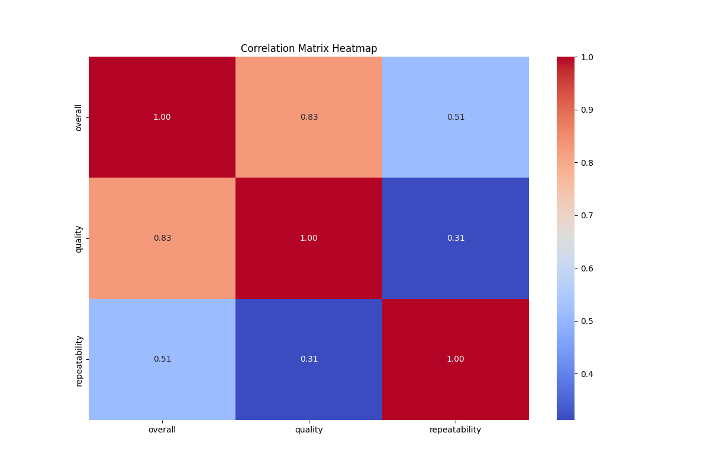

# Analysis Report

## Narrative

### Dataset Overview and Analysis

The dataset in question consists of 2,652 observations across three key variables: **overall**, **quality**, and **repeatability**. Each variable seemingly represents evaluative metrics, presumably for a process or product, where higher values may indicate better performance or satisfaction.

#### 1. Summary Statistics and Key Relationships

- **Overall**:
  - Mean: 3.05 (near the mid-range of 1-5 scale)
  - Standard Deviation: 0.76 indicates some variability in overall scores.
  - Range from minimum 1.00 to maximum 5.00.

- **Quality**:
  - Mean: 3.21, slightly higher than overall, suggesting perceived quality may be more positively skewed.
  - Standard Deviation: 0.80, indicating greater variability in quality assessments.
  - Ranges from 1.00 to 5.00.

- **Repeatability**:
  - Mean: 1.49, noticeably low, indicating that repeatability is often perceived as insufficient or inconsistent.
  - Standard Deviation: 0.60, suggesting less spread and more consistency in the responses.
  - Ranges from 1.00 to 3.00, with the maximum capped at 3.

The **correlation matrix** reveals prominent relationships between the variables:
- **Overall and Quality** have a high positive correlation (0.83), suggesting that higher quality ratings significantly influence overall evaluations.
- **Overall and Repeatability** also have a moderate positive correlation (0.51), indicating that better repeatability contributes to better overall scores.
- The correlation between **Quality and Repeatability** is lower (0.31), suggesting that while they are related, quality assessments are influenced by more than just repeatability.

#### 2. Significant Features from Regression Coefficients

The regression analysis identifies the following coefficients:
- **Quality** coefficient: 0.718
- **Repeatability** coefficient: -0.122

Given the positive coefficient for quality, it indicates a strong positive relationship with overall scores. In contrast, the negative coefficient for repeatability suggests that as repeatability scores improve, this factor may still result in an overall score decrease, which is unexpected and could warrant further investigation or might reflect how repeatability is contextualized relative to overall perceptions.

#### 3. Interpretation of Regression Results

- **Intercept**: 3.21, the predicted overall score when both quality and repeatability are at zero, which isn't a realistic scenario here but provides a base reference.
- **Mean Squared Error (MSE)**: 0.19 indicates the average squared difference between observed and predicted values, reflecting a relatively good fit of the model without excessive error.
- **R-squared Value**: 0.69 indicates that about 69% of the variance in overall scores can be explained by the linear relationship with quality and repeatability. This suggests a moderately strong predictive capability of the model.

#### 4. Actionable Insights

Based on the analysis, key insights include:
- **Investment in Quality**: Since quality significantly correlates with the overall scores, stakeholders should prioritize maintaining or enhancing quality to improve overall perceptions.
- **Review of Repeatability Metrics**: Due to the surprising negative coefficient for repeatability, a deeper analysis may be required to understand its role in customer perception and experience, addressing underlying issues or misunderstandings that may skew results.

#### 5. Narrative on Findings and Recommendations

This dataset serves as a valuable resource for understanding customer perceptions of a product or process. Key findings indicate a strong connection between quality and overall ratings, while repeatability lags significantly, both in score and correlation. Stakeholder actions should focus on quality enhancement initiatives, ensuring that customer expectations are consistently met or exceeded. 

The unexpected negative impact of repeatability on overall scores could suggest a misalignment of how repeatability is perceived by users versus what is actually delivered. Therefore, a detailed investigation into customer feedback regarding repeatability might uncover actionable opportunities for improvement.

In conclusion, leveraging this analysis may guide strategic decision-making, focusing on enhancing perceived quality and re-evaluating the perception of repeatability within the customer experience. Future research may explore additional factors influencing perceptions and potentially extend the analysis to uncover the nuances in customer feedback mechanisms.

## Visualizations

To effectively illustrate findings from a dataset with 2652 rows and 3 columns characterized by the key features: overall, quality, and repeatability, consider the following three visualizations:

1. **Scatter Plot**:
   - **Purpose**: To explore the relationship between two continuous variables, such as 'quality' and 'repeatability'.
   - **Design**: Plot 'quality' on the x-axis and 'repeatability' on the y-axis. Each point represents a row in the dataset. You could use color coding or different marker shapes to indicate different categories or groups present in the data.
   - **Benefits**: This visualization will help you identify trends, correlations, or clusters in the data, allowing for a quick visual assessment of how quality and repeatability may be related.

2. **Box Plot**:
   - **Purpose**: To summarize the distribution of 'overall' and assess its variation based on 'quality' or 'repeatability' categories.
   - **Design**: Create a box plot for 'overall' scores, with separate boxes for different levels of 'quality' or 'repeatability' (e.g., low, medium, high). This will clearly show median values, interquartile ranges, and potential outliers.
   - **Benefits**: This visualization allows for easy comparison of 'overall' scores across different categories, showcasing the central tendency and variability within groups.

3. **Heatmap**:
   - **Purpose**: To provide an overview of the relationship between 'quality' and 'repeatability', showing the frequency or density of occurrences across different combinations.
   - **Design**: Create a matrix with 'quality' on one axis and 'repeatability' on the other, filling the cells with color gradients representing the number or percentage of occurrences. 
   - **Benefits**: This visualization helps to identify patterns or hotspots in the dataset, allowing viewers to quickly grasp where the most frequent combinations of quality and repeatability occur.

By utilizing these three visualizations, you will be able to effectively communicate the relationships and insights derived from the dataset regarding overall performance, quality metrics, and consistency or repeatability.
### Correlation Matrix

